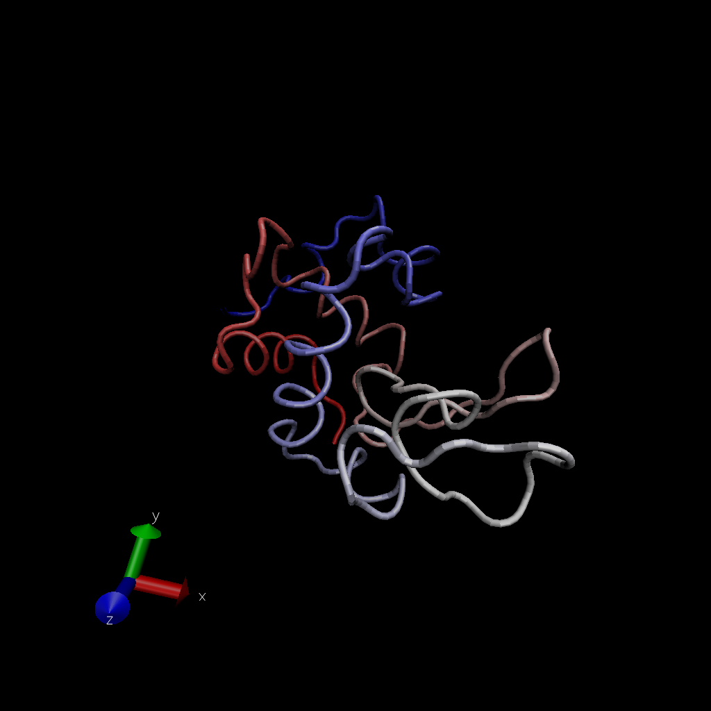
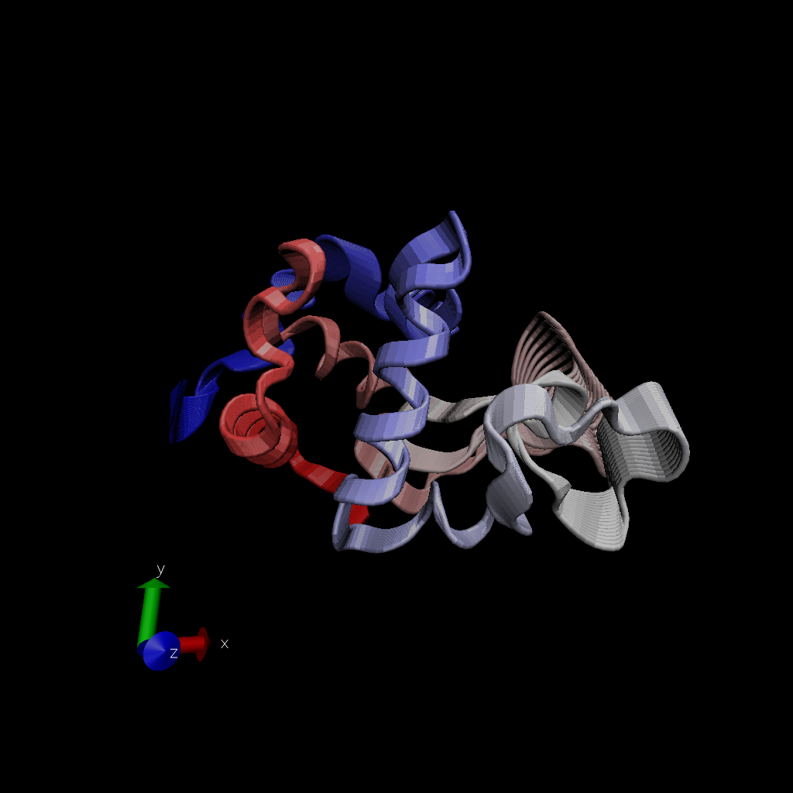
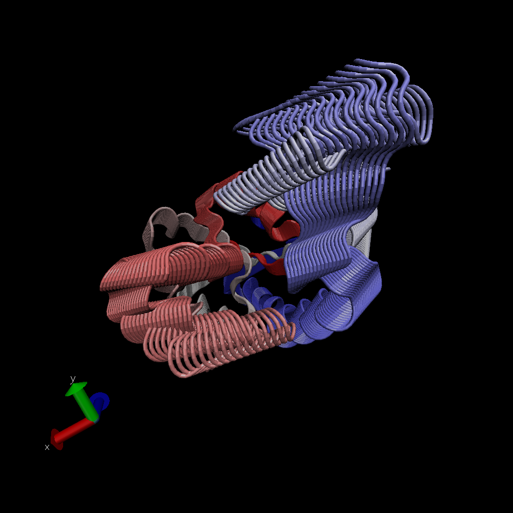
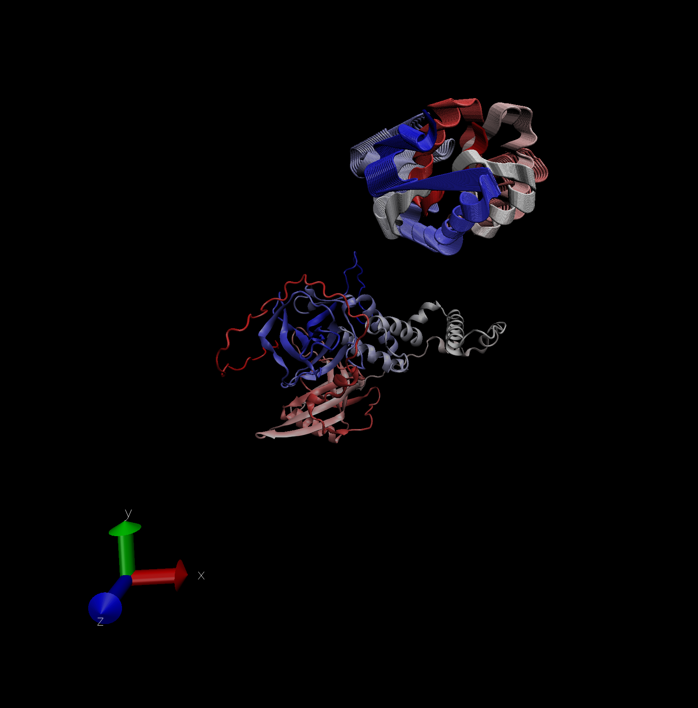

```{r}
library(bio3d)

pdb <- read.pdb("1hel")
pdb
```
```{r}
head(pdb$atom)
```


### Lets do a quick bioinformatics prediction of protein dynamics (Flexibility). We use the 'nma()' function, which does Normal Mode Analysis. 

```{r}
modes <- nma(pdb)
plot(modes)
```

Make a trajectory of this prediction with the 'mktrj()' function. 
```{r}
mktrj(modes, file="nma.pdb")
```

## Set Multiple Frames default "now"


# Set Multiple Frames to 1:100



# Compartive Structural Analysis
## __Seq__ -> 'Blast.pdb()' __PDB__ -> 'GET.pdb()' __Structures__ -> 'pdbaln()' __MSA__ -> __PCA__
### Start by getting a sequence of interest. 

```{r}
aa <- get.seq("1AKE_A")
aa
```

### Code below to search the PDB data base (the main db for exp structures) for sequences such as this "aa" sequence above.
```{r}
blast <- blast.pdb(aa)
```

## hit score, showing that just 16 are top hits. 
## e-value in -log because the e-value numbers are small values. 
## percent identity
## length: 
```{r}
hits <- plot(blast)
```


### Now the top hits have been reported from the search of the PDB. Structures in the database that are most likemind sequences. 

```{r}
# pdb identity by using pdb.id
hits$pdb.id
```


```{r}
# Download related PDB files
files <- get.pdb(hits$pdb.id, path="pdbs", split=TRUE, gzip=TRUE)
```

## pdbaln() to align
```{r}
# Align related PDBs
pdbs <- pdbaln(files, fit = TRUE)
```

```{r}
pdbs
```


```{r}
# Vector containing PDB codes for figure axis
ids <- basename.pdb(pdbs$id)

# Draw schematic alignment
plot(pdbs, labels=ids)
```

```{r}
pdbs$xyz
```
## Principal Component Analysis (PCA)
### Here we will do a PCA on the xyz coordinate data of all these structures with the 'pca()' function in bio3d. 

```{r}
pcs <- pca(pdbs)
plot(pcs)
```

## Lets visualize the displacements (i.e. movements of the structure) that are captured by PC1

```{r}
mktrj(pcs, pc=1, file="pca.pdb")
```



## Lets save our important results 
```{r}
save(blast, hits, pca, pdbs, file="pdbc11results.RData")
# To load all results next time just type in 'load("pdbc11results.RData")'
```


## Section 1: In silico docking of drugs to HIV-1 protease
### __Q1:__ What is the name of the two non protein resid values in this structure? What does resid correspond to and how would you get a listing of all reside values in this structure? 

### __Q2:__ Can you locate the binding site visually? Note that crystal structures normally lack hydrogen atoms, why?

### __Q3:__ Look at the charges. Does it make sense (e.g. based on your knowledge of the physiochemical properties of amino acids)?

### __Q4:__ Qualitatively, how good are the docks? Is the crystal binding mode reproduced? Is it the best conformation according to AutoDock Vina?

### __Q5:__ Quantitatively how good are the docks? Is the crystal binding mode reproduced within 1Å RMSD for all atoms? 

### __Q6:__ How would you determine the RMSD for heavy atoms only (i.e. non hydrogen atoms)? HINT: The atom.select() function will be of help here along with the selection string “noh” for no hydrogens.

### __Q7:__ What are the most flexible portions of HIV-1 protease? Would this flexibility likely effect docking calculations to this protein?

