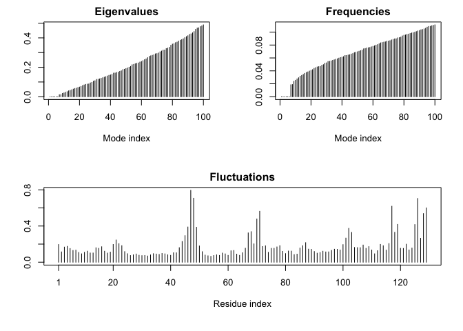

Untitled
================

# 1: Introduction to the RCSB Protein Data Bank (PDB)

``` r
# Read in downloaded csv file. 
pdb.data <- read.csv("Data Export Summary.csv", row.names = 1)
pdb.data
```

    ##                          X.ray   NMR   EM Multiple.methods Neutron Other  Total
    ## Protein (only)          142419 11807 6038              177      70    32 160543
    ## Protein/Oligosaccharide   8426    31  991                5       0     0   9453
    ## Protein/NA                7498   274 2000                3       0     0   9775
    ## Nucleic acid (only)       2368  1378   60                8       2     1   3817
    ## Other                      149    31    3                0       0     0    183
    ## Oligosaccharide (only)      11     6    0                1       0     4     22

## **Q1**: What percentage of structures in the PDB are solved by X-Ray and Electron Microscopy.

``` r
library(skimr)
skim(pdb.data)
```

|                                                  |          |
|:-------------------------------------------------|:---------|
| Name                                             | pdb.data |
| Number of rows                                   | 6        |
| Number of columns                                | 7        |
| \_\_\_\_\_\_\_\_\_\_\_\_\_\_\_\_\_\_\_\_\_\_\_   |          |
| Column type frequency:                           |          |
| numeric                                          | 7        |
| \_\_\_\_\_\_\_\_\_\_\_\_\_\_\_\_\_\_\_\_\_\_\_\_ |          |
| Group variables                                  | None     |

Data summary

**Variable type: numeric**

| skim_variable    | n_missing | complete_rate |     mean |       sd |  p0 |     p25 |    p50 |     p75 |   p100 | hist  |
|:-----------------|----------:|--------------:|---------:|---------:|----:|--------:|-------:|--------:|-------:|:------|
| X.ray            |         0 |             1 | 26811.83 | 56749.93 |  11 |  703.75 | 4933.0 | 8194.00 | 142419 | ▇▁▁▁▂ |
| NMR              |         0 |             1 |  2254.50 |  4709.24 |   6 |   31.00 |  152.5 | 1102.00 |  11807 | ▇▁▁▁▂ |
| EM               |         0 |             1 |  1515.33 |  2352.26 |   0 |   17.25 |  525.5 | 1747.75 |   6038 | ▇▂▁▁▂ |
| Multiple.methods |         0 |             1 |    32.33 |    70.93 |   0 |    1.50 |    4.0 |    7.25 |    177 | ▇▁▁▁▂ |
| Neutron          |         0 |             1 |    12.00 |    28.43 |   0 |    0.00 |    0.0 |    1.50 |     70 | ▇▁▁▁▂ |
| Other            |         0 |             1 |     6.17 |    12.75 |   0 |    0.00 |    0.5 |    3.25 |     32 | ▇▁▁▁▂ |
| Total            |         0 |             1 | 30632.17 | 63786.50 |  22 | 1091.50 | 6635.0 | 9694.50 | 160543 | ▇▁▁▁▂ |

``` r
sum(pdb.data$X.ray)
```

    ## [1] 160871

``` r
sum(pdb.data$Total)
```

    ## [1] 183793

``` r
round((pdb.data$X.ray) / sum(pdb.data$Total) *100, 2)
```

    ## [1] 77.49  4.58  4.08  1.29  0.08  0.01

``` r
round((colSums(pdb.data) / sum(pdb.data$Total)) *100, 2)
```

    ##            X.ray              NMR               EM Multiple.methods 
    ##            87.53             7.36             4.95             0.11 
    ##          Neutron            Other            Total 
    ##             0.04             0.02           100.00

## **Q2:** What proportion of structures in the PDB are protein?

``` r
# Calling for total of "protein only"
prot.only <- pdb.data$Total[1]
prot.only
```

    ## [1] 160543

``` r
# The proportion of "protein only" 
prot.prop <- prot.only/sum(pdb.data$Total)
prot.prop
```

    ## [1] 0.873499

## **Q3:** Type HIV in the PDB website search box on the home page and determine how many HIV-1 protease structures are in the current PDB?

### There were 22, 824 protease protein structures for HIV-1.

# 2. Visualizing the HIV-1 protease structure


# Using Bio3D in R for struftural bioinformatics

``` r
library(bio3d)
pdb <- read.pdb("1hel")
pdb
```

``` r
pdb$atom
```

``` r
head(pdb$atom)
```

    ##   type eleno elety  alt resid chain resno insert      x      y      z o     b
    ## 1 ATOM     1     N <NA>   LYS     A     1   <NA>  3.294 10.164 10.266 1 11.18
    ## 2 ATOM     2    CA <NA>   LYS     A     1   <NA>  2.388 10.533  9.168 1  9.68
    ## 3 ATOM     3     C <NA>   LYS     A     1   <NA>  2.438 12.049  8.889 1 14.00
    ## 4 ATOM     4     O <NA>   LYS     A     1   <NA>  2.406 12.898  9.815 1 14.00
    ## 5 ATOM     5    CB <NA>   LYS     A     1   <NA>  0.949 10.101  9.559 1 13.29
    ## 6 ATOM     6    CG <NA>   LYS     A     1   <NA> -0.050 10.621  8.573 1 13.52
    ##   segid elesy charge
    ## 1  <NA>     N   <NA>
    ## 2  <NA>     C   <NA>
    ## 3  <NA>     C   <NA>
    ## 4  <NA>     O   <NA>
    ## 5  <NA>     C   <NA>
    ## 6  <NA>     C   <NA>

### Do a Normal Mode Analysis (NMA) a prediction of the conformational variability and instrinsic dynamics of this protein.

``` r
pdb <- read.pdb("1hel")
```

    ##   Note: Accessing on-line PDB file

    ## Warning in get.pdb(file, path = tempdir(), verbose = FALSE): /var/folders/_h/
    ## tfb8m8vj6h12d2sd7qj55b900000gn/T//RtmpYwVFkt/1hel.pdb exists. Skipping download

``` r
m <- nma(pdb)
```

    ##  Building Hessian...     Done in 0.006 seconds.
    ##  Diagonalizing Hessian...    Done in 0.063 seconds.

``` r
plot(m)
```

<!-- -->

# Make a little movie (trajectory) for viewing in VMD.

``` r
mktrj(m, file="nma.pdb")
```
